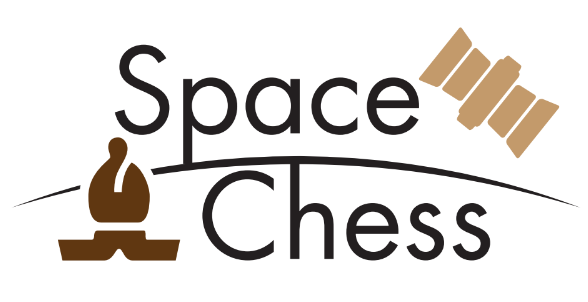
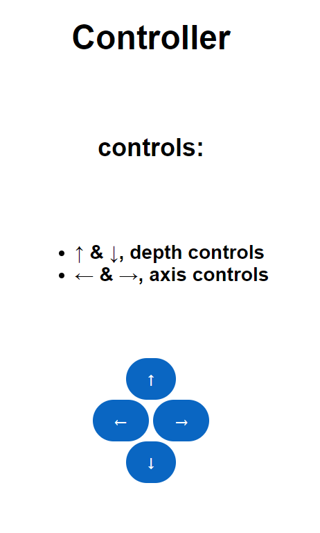
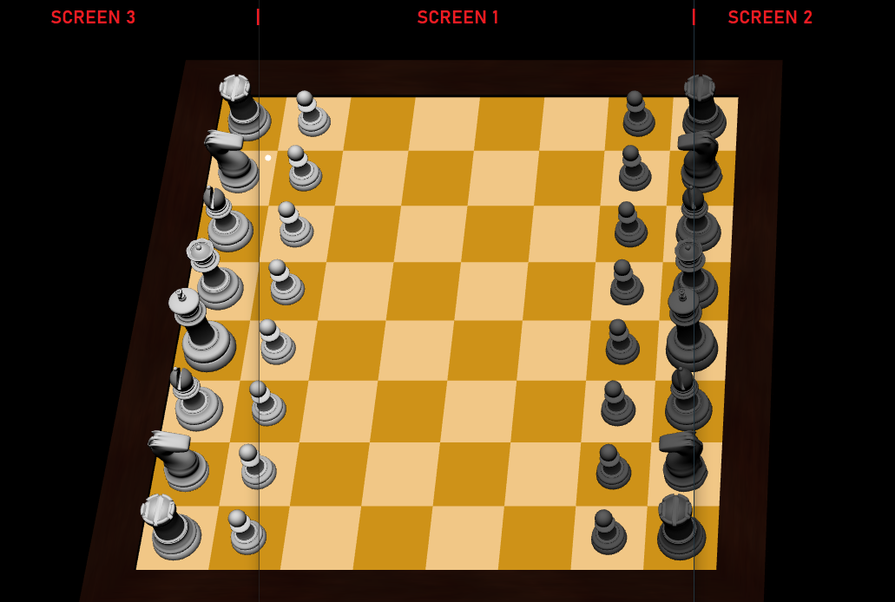

# 🚀 SPACE CHESS

A Newspace related visualization project in collaboration with Hydra-Space.    
The basic idea is to use the Liquid Galaxy cluster as a visualizer of a world chess game that will happen with people around the world and through satellite communications, a world&apos;s first !!!

Two teams, the Earth (🌎)(you) and the Space (🛰️) (a strong AI) <br/>
Every day the Earth makes one move (at least), the most common move between you all, so play as a community and
not as an individual.

Once the Earth has made the move, wait for the Space.
The satellite may take a while to make its move, so you may not see it in hours, so be patient.

<p align="center">

</p>


## ✏️ Running Requirements
1. Make sure the Liquid Galaxy core is installed. Check out the git hub [repository](https://github.com/LiquidGalaxyLAB/liquid-galaxy)
2. Make sure **Node.js version 16** is installed on the master machine by running:
```bash
node -v
```
-  The output should look someting like `v16.*.*`, if this is not the case it should still work, if not, try upgrading to the version 16.

3. Install pm2 on master machine. Run command:
```bash
sudo npm i -g pm2
```
4. Make sure Chromium Browser is installed on all machines.


## 🖥️ Installation & Launch
Open a new terminal and go to the '~' (default) directory with the command:
```bash
cd ~
```

Now, clone the repository **in the current directory (default directory on terminal)** of the **master** machine with the command:
```bash
git clone https://github.com/PabloSanchi/LiquidGalaxyVisualization
```

Go to the new folder (github repository) and execute the installation script.
Use the following commands:
```bash
cd LiquidGalaxyVisualization
bash install.sh
```

<!-- 
After the game is installed make sure to reboot your machine! Once it is done rebooting, the game can be opened by executing the open script in the *LiquidGalaxyVisualization* directory with: -->

After the packages are installed, then run the following command:
```bash
python3 open.py NUMSCREEN
```
<!-- ```bash
npm start NUMSCREEN
bash open-chess.sh
``` -->

***NUMSCREEN is the number of screens that you want to use, by deafult is 5, so make sure to set it properly according to your rig setup.***


<p style="font-size: 15px;"> 
⚠️ Warning <br/>
 - IT MAY LAST A BIT TO LOAD THE CHESSBOARD <br/>
</p>

<!-- If you experience any problems, check the installation logs for any possible errors in the logs folder, there will be a file with the date of installation as it's name. -->


If you are experiencing some errors while executing the `open.py` script, kill it and re-start it.
- Stop the server
- `bash kill-chess.sh`
- `python3 open.py NUMSCREEN`
<!-- - Stop the server
- `bash kill-chess.sh`
- Restart the server `bash open-chess.sh NUMSCREEN` -->


## Keyboard Controls (test only)
- ZOOM: **w** & **s** keyboard keys
- AXIS Movement: **a** & **d** keyboard keys

## Web Controller (test only)
Type on your browser the following url<br/>
- MASTERIP:port/controller
  
Example:
```bash
http://192.168.0.11:8120/controller
```


<p align="center">

</p>

<p style="font-size: 15px;"> 
⚠️ Warning <br/>
- DEMO cannot be stopped <br/>
</p>

## 📺 Final view (3 Screen example)
<p align="center">

</p>